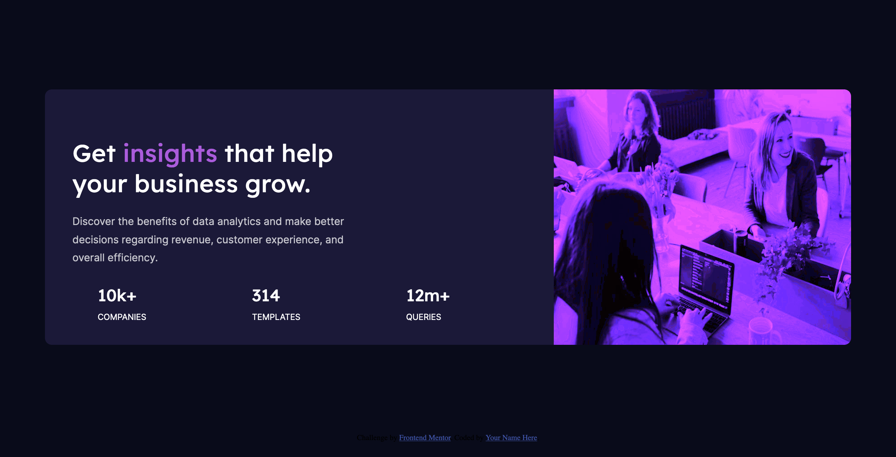

# Frontend Mentor - Stats preview card component solution

This is a solution to the [Stats preview card component challenge on Frontend Mentor](https://www.frontendmentor.io/challenges/stats-preview-card-component-8JqbgoU62). Frontend Mentor challenges help you improve your coding skills by building realistic projects. 

## Table of contents

- [Overview](#overview)
  - [The challenge](#the-challenge)
  - [Screenshot](#screenshot)
  - [Links](#links)
- [My process](#my-process)
  - [Built with](#built-with)
  - [What I learned](#what-i-learned)
  - [Continued development](#continued-development)
- [Author](#author)

## Overview

### The challenge

Users should be able to:

- View the optimal layout depending on their device's screen size

### Screenshot



### Links

- Solution URL: [Add solution URL here](https://www.frontendmentor.io/solutions/stats-card-component-made-with-htmlcss-and-flexbox-EGYSvKPBL)
- Live Site URL: [Netlify live site](https://optimistic-newton-b937d3.netlify.app/)

## My process

### Built with

- Semantic HTML5 markup
- CSS custom properties
- Flexbox
- Mobile-first workflow

### What I learned

This was the first time I implemented a filter on an image to change the image color and saturation.  

```
img { 
    width: 100%;
    border-radius: 10px 10px 0 0;
    filter: brightness(50%) sepia(50) saturate(40) hue-rotate(257deg);
}
```

### Continued development

For my next project I would like to start implementing SASS/SCSS to become more familiar with other types of styling. 


## Author

- Website - [Monica McLaughlan](https://www.monicamclaughlan.com)
- Frontend Mentor - [@monicamclaughlan](https://www.frontendmentor.io/profile/monicamclaughlan)
- LinkedIn - [Monica McLaughlan](https://www.linkedin.com/in/monica-mclaughlan-413b8a106/)


